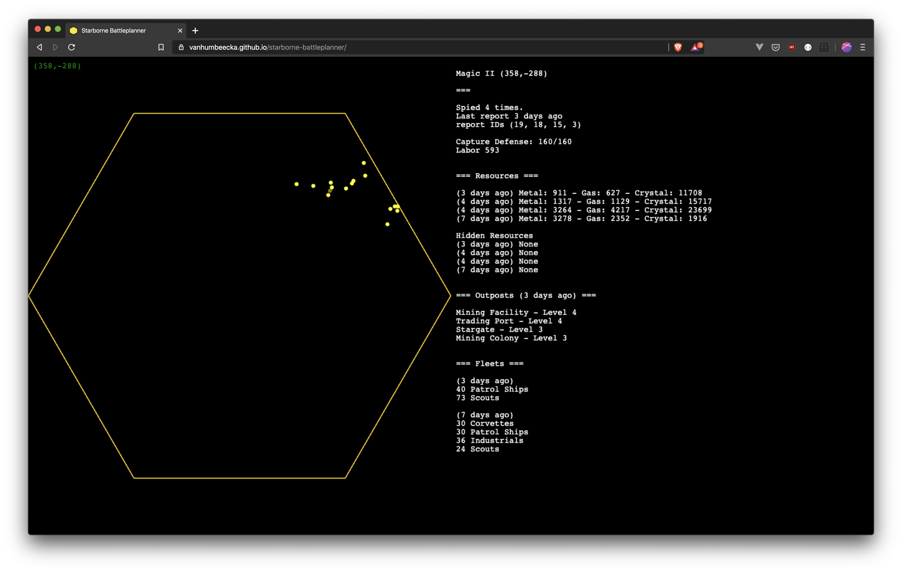

# Starborne battleplanner


*Starborne Battleplanner* shows data on a hexagonal map, using the same coordinate system as [Starborne](https://starborne.com/) itself.
At the moment, only some spy reports are shown.

Read the accompanying [blogpost](https://blog.codemine.be/posts/20200415-fun-with-phaser/) on how this was build.

## Preview



## Development

The project uses the following tech:
- TypeScript & Webpack
- [Phaser v3](https://phaser.io/) as "front-end framework"
- Mocha & Chai for unit tests

To install dependencies, run
```
yarn
```

To develop locally, run
```
yarn dev
```

To test, run
```
yarn test
```

To build, run
```
yarn build
```

